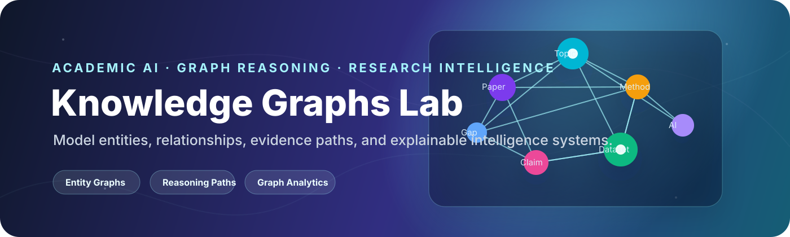
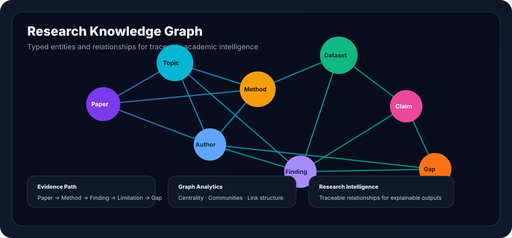
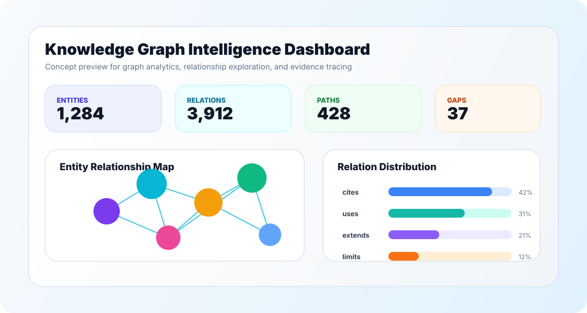
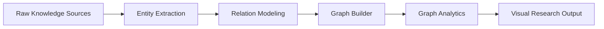
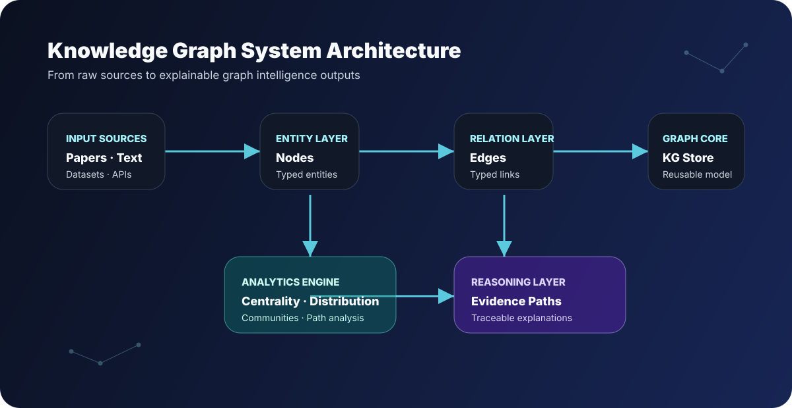
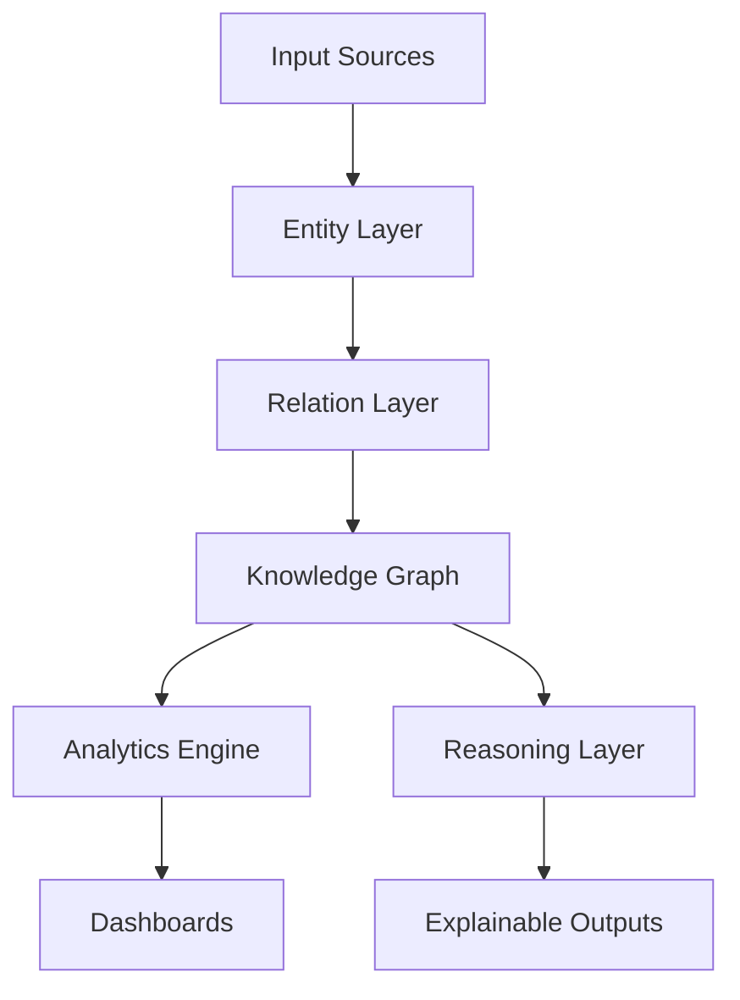
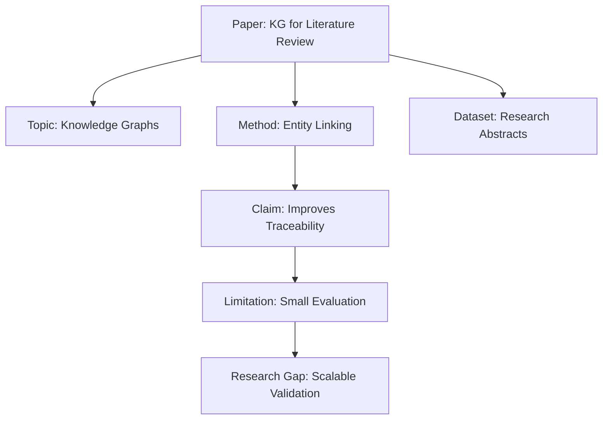

<p align="center">
  
</p>

<h1 align="center">Knowledge Graphs Lab</h1>

<p align="center">
  <b>A research-grade knowledge graph laboratory for modeling entities, relationships, reasoning paths, and graph-based intelligence systems.</b>
</p>

<p align="center">
  
  
  
  
  
</p>

---

## Overview

**Knowledge Graphs Lab** is a research-focused repository for building, analyzing, and documenting knowledge graph systems. It is designed for academic projects, PhD-level experimentation, AI research prototypes, semantic data modeling, and graph-based reasoning workflows.

The repository demonstrates how scattered information can be converted into structured intelligence by representing knowledge as:

- **Entities** — papers, authors, concepts, datasets, methods, systems, risks, or policies.
- **Relations** — cites, uses, extends, contradicts, belongs to, depends on, or explains.
- **Evidence paths** — traceable graph routes that connect claims to supporting nodes.
- **Analytics** — centrality, communities, relation distributions, and graph summaries.
- **Research outputs** — visual maps, literature matrices, reasoning diagrams, and reusable datasets.

<p align="center">
  
</p>

---

## Why this project matters

Modern AI systems increasingly depend on structured context. A knowledge graph makes relationships explicit, searchable, auditable, and reusable. Instead of storing information as isolated text, a graph allows researchers to ask deeper questions:

- Which concepts connect separate research areas?
- Which papers, methods, or datasets are central in a domain?
- Which entities act as bridges between communities?
- Which claims lack evidence or depend on weak links?
- How can retrieval systems become more explainable?
- How can literature reviews become traceable and reproducible?

This repository is built to support those questions through practical code, clean documentation, and attractive visual communication.

---

## Visual Research Dashboard Concept

<p align="center">
  
</p>

The dashboard concept shows how graph systems can present:

| Area | Purpose |
|---|---|
| Graph overview | Display entities and typed relationships |
| Centrality panel | Identify influential nodes |
| Relation analytics | Show how knowledge is connected |
| Evidence path view | Trace reasoning from source to conclusion |
| Research notes | Connect graph patterns to academic interpretation |

---

## Core Features

### 1. Research Knowledge Modeling

Represent academic or domain knowledge as structured nodes and edges.

Supported example node types:

| Node type | Example |
|---|---|
| Paper | A research article or technical report |
| Author | A researcher or institution |
| Topic | Knowledge graph completion, semantic search, explainable AI |
| Method | Graph neural network, entity linking, ontology matching |
| Dataset | Benchmark corpus, citation network, RDF dataset |
| Claim | A proposed contribution or finding |
| Limitation | Missing evaluation, sparse labels, biased dataset |

### 2. Graph Construction Pipeline



### 3. Graph Analytics

The current Python scaffold includes simple analytics for:

- Node and edge counts.
- Node type distribution.
- Relation type distribution.
- Degree-based central nodes.
- Reusable graph loading from JSON.

### 4. Explainable Reasoning Paths

A graph can make AI reasoning easier to inspect by exposing the path between a question, relevant entities, supporting evidence, and a final answer.

Example:

```text
Research Question → Topic → Method → Dataset → Evaluation Result → Limitation → Research Gap
```

### 5. Academic Documentation

The repository includes documentation for architecture, research use cases, and future roadmap so the project reads like a serious academic research prototype rather than a simple code dump.

---

## System Architecture

<p align="center">
  
</p>



---

## Repository Structure

```text
knowledge-graphs/
├── README.md
├── LICENSE
├── pyproject.toml
├── requirements.txt
├── assets/
│   ├── banner.svg
│   ├── graph-preview.svg
│   ├── dashboard-preview.svg
│   └── system-architecture.svg
├── data/
│   └── sample_research_graph.json
├── docs/
│   ├── architecture.md
│   ├── research-use-cases.md
│   └── roadmap.md
├── examples/
│   └── build_demo_graph.py
├── src/
│   └── kg_lab/
│       ├── __init__.py
│       ├── analytics.py
│       ├── builder.py
│       └── models.py
└── tests/
    └── test_graph_builder.py
```

---

## Quick Start

### 1. Clone the repository

```bash
git clone https://github.com/Hirakhyzer/knowledge-graphs.git
cd knowledge-graphs
```

### 2. Create a virtual environment

```bash
python -m venv .venv
source .venv/bin/activate
```

On Windows:

```bash
.venv\Scripts\activate
```

### 3. Install dependencies

```bash
pip install -r requirements.txt
```

### 4. Run the demo graph

```bash
python examples/build_demo_graph.py
```

Expected output includes a graph summary, relation distribution, and central nodes from the sample research graph.

---

## Example Usage

```python
from kg_lab.builder import build_graph_from_json
from kg_lab.analytics import graph_summary, top_degree_nodes

graph = build_graph_from_json("data/sample_research_graph.json")

print(graph_summary(graph))
print(top_degree_nodes(graph, limit=5))
```

---

## Sample Research Graph

The included sample graph models a small academic knowledge domain:



The sample data is stored in:

```text
data/sample_research_graph.json
```

---

## Academic Use Cases

### Literature Review Mapping

Use a graph to connect papers, methods, datasets, findings, limitations, and gaps.

### Explainable AI

Use entity-relation paths to explain why a model retrieved, ranked, or recommended a result.

### Cybersecurity Intelligence

Model threats, vulnerabilities, assets, controls, incidents, and mitigation strategies.

### Healthcare Knowledge Modeling

Connect symptoms, diagnoses, treatments, evidence levels, and clinical guidelines in a traceable structure.

### Smart City Systems

Represent sensors, infrastructure, events, services, policies, and risk signals as connected entities.

---

## Research Questions This Repo Can Support

- How can knowledge graphs improve explainability in AI systems?
- How can graph centrality identify important concepts in a research domain?
- How can literature review evidence be represented as typed relations?
- How can knowledge graph paths support transparent decision-making?
- How can graph analytics reveal hidden gaps in academic literature?

---

## Roadmap

### Phase 1 — Foundation

- [x] Professional README and visual assets
- [x] Sample graph dataset
- [x] Python graph builder
- [x] Basic graph analytics
- [x] Documentation structure

### Phase 2 — Research Intelligence

- [ ] Entity extraction pipeline
- [ ] Relation classification module
- [ ] Graph visualization dashboard
- [ ] Literature review graph template
- [ ] Citation network analysis

### Phase 3 — Advanced Knowledge Graph AI

- [ ] Graph embeddings
- [ ] Community detection
- [ ] Link prediction experiments
- [ ] Graph-based retrieval augmentation
- [ ] Explainable reasoning paths

### Phase 4 — Academic Publication Support

- [ ] Exportable research matrix
- [ ] Graph summary report generator
- [ ] Reproducible experiment notebooks
- [ ] Evaluation benchmark documentation
- [ ] Research paper template integration

---

## Design Principles

1. **Traceability** — every relation should be connected to evidence.
2. **Explainability** — graph outputs should be understandable to researchers.
3. **Modularity** — graph construction, analytics, and visualization should remain separate.
4. **Reproducibility** — datasets, code, and outputs should be documented clearly.
5. **Academic usefulness** — the project should help with real research workflows.

---

## Ethical Use

Knowledge graphs can make information systems more transparent, but they can also encode incomplete or biased assumptions. Any graph produced from external sources should be validated, documented, and treated as a model of knowledge rather than absolute truth.

---

## Contributing

Contributions are welcome. Helpful areas include:

- More sample graph datasets.
- Better graph analytics.
- Visualization components.
- Academic documentation.
- Tests and reproducible examples.

Please see [`CONTRIBUTING.md`](CONTRIBUTING.md) for contribution guidance.

---

## License

This project is released under the MIT License.

---

## Author

Created by **Hira Khyzer** as an academic AI and knowledge representation project.

<p align="center">
  <b>Knowledge Graphs Lab — transform information into connected, explainable intelligence.</b>
</p>
